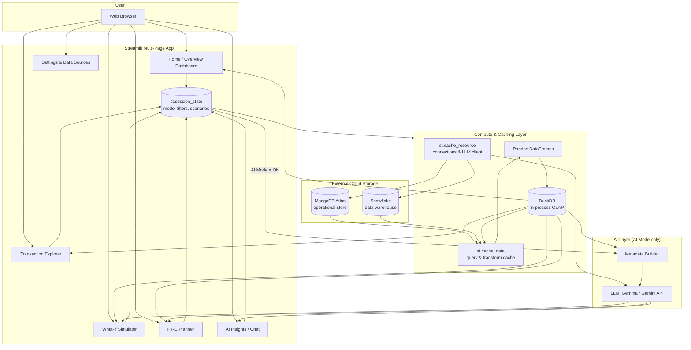
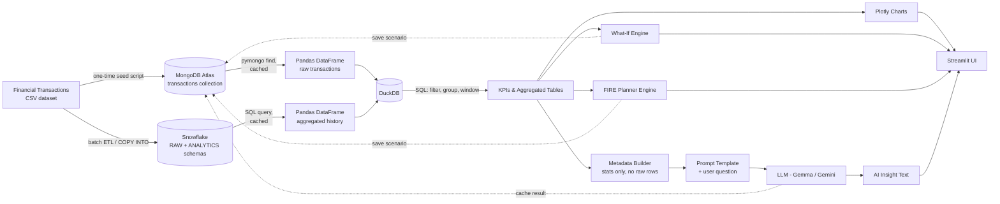

# AI Personal Finance Intelligence Platform
## Architecture & Requirement Analysis (Pre-Implementation)

**Role:** Lead Solution Architect, DADS5001 Final Project
**Status:** Design phase — no application code yet
**Dataset:** Financial Transactions Dataset (Expenses & Income)

---

## 0. Project Checklist (from PDF + Prompt)

### From the course PDF
- [ ] Topic: data-centric app with an AI add-on (Gemma 4 Good Hackathon theme)
- [ ] Multi-page Streamlit app
- [ ] Use DuckDB and Pandas
- [ ] Use external cloud storage: MongoDB **and** Snowflake
- [ ] Two modes: Non-AI vs AI
- [ ] Use `st.cache_data`, `st.cache_resource`, and `st.session_state`
- [ ] Presentation deck: Title, Issues/Motivation, Objective, Solution (Non-AI + AI), Visualization (Streamlit + Plotly), Demo video
- [ ] Presentation: 10–15 min, group of 3–5
- [ ] Submit via GitHub

### From this prompt (course requirement list)
- [ ] Streamlit Multi-page
- [ ] Pandas
- [ ] DuckDB
- [ ] MongoDB Atlas
- [ ] Snowflake
- [ ] Non-AI Mode
- [ ] AI Mode
- [ ] Cache Data
- [ ] Cache Resource
- [ ] Session State
- [ ] Plotly Visualization
- [ ] GitHub Submission
- [ ] Streamlit Deployment

**Guiding principle (per instructions): requirement compliance > feature complexity.** Every architectural decision below is justified first by "which checklist item does this satisfy," not by novelty.

---

## 1. Requirement Mapping Table

| # | Requirement | Where It Lives in the Architecture | Streamlit/Tech Feature |
|---|---|---|---|
| 1 | Multi-page Streamlit | `pages/` folder with 6 pages (Overview, Explorer, What-If, FIRE Planner, AI Insights, Settings) | Native Streamlit multi-page (`pages/` dir + `st.Page`/`st.navigation`) |
| 2 | Pandas | All in-memory data wrangling between ingestion and DuckDB/Plotly | `pandas.DataFrame` |
| 3 | DuckDB | Local OLAP layer for filtering, grouping, window functions on transactions | `duckdb.connect()`, `duckdb.sql()` over Pandas/Parquet |
| 4 | MongoDB Atlas | Operational store: raw transactions, saved scenarios, AI response cache | `pymongo`, `st.cache_resource` for client |
| 5 | Snowflake | Cloud data warehouse: historical aggregates, long-range trend marts | `snowflake-connector-python`, `st.cache_data` for query results |
| 6 | Non-AI Mode | Default mode — KPIs, tables, Plotly charts, deterministic What-If/FIRE math | `st.session_state["mode"] == "Non-AI"` |
| 7 | AI Mode | Adds Metadata Builder → LLM narrative insights, chat, recommendations | `st.session_state["mode"] == "AI"`, toggle in sidebar |
| 8 | Cache Data | All query/transform functions returning DataFrames (Mongo reads, Snowflake reads, DuckDB aggregations, metadata snapshots) | `@st.cache_data(ttl=...)` |
| 9 | Cache Resource | DB connections (MongoDB client, Snowflake connection, DuckDB connection, LLM client) | `@st.cache_resource` |
| 10 | Session State | Active mode, filter selections, What-If sliders, FIRE assumptions, chat history | `st.session_state` |
| 11 | Plotly Visualization | All charts: trend lines, category breakdowns, simulator comparisons, FIRE projection curves | `plotly.express` / `plotly.graph_objects` via `st.plotly_chart` |
| 12 | GitHub Submission | Full repo with README, architecture doc, `requirements.txt`, `.gitignore`, demo video link | Repo structure in Section 10 |
| 13 | Streamlit Deployment | App deployed to Streamlit Community Cloud, secrets via `st.secrets` | `.streamlit/secrets.toml` (not committed) |
| 14 | Data-centric + AI add-on theme | Core app works fully without AI; AI is an optional enrichment layer | Mode toggle architecture |
| 15 | What-If Simulator | Dedicated page + `src/analytics/what_if.py` engine | DuckDB recompute + Plotly comparison |
| 16 | FIRE Planner | Dedicated page + `src/analytics/fire_planner.py` engine | Compound-growth model + Plotly projection |
| 17 | Presentation assets | Issues/motivation, objective, methodology slides built from this doc | Separate `docs/` deliverable (not in scope here) |

---

## 2. High-Level Architecture (Mermaid)



**Key idea:** the Non-AI path (Pandas → DuckDB → Plotly) is fully self-contained. The AI Layer sits "on top" and is only invoked when AI Mode is active, satisfying the "AI as an add-on" requirement.

---

## 3. Data Flow Diagram (Mermaid)



---

## 4. MongoDB Atlas Architecture

**Role:** operational / document store for raw-ish transactional data, user-saved scenarios, and AI response cache. Chosen because transaction records and scenario configs are naturally semi-structured (variable fields, nested params).

**Cluster:** Atlas free tier (M0) is sufficient for project scope.
**Database:** `personal_finance`

| Collection | Purpose | Example Document Shape | Indexes |
|---|---|---|---|
| `transactions` | Loaded copy of the Expenses & Income dataset | `{_id, date, type: "Income"/"Expense", category, subcategory, amount, currency, description, payment_method, created_at}` | `{date: 1}`, `{category: 1, type: 1}` |
| `categories_meta` | Lookup/dimension for consistent labels, colors, icons used across charts | `{category, subcategory, default_type, color_hex}` | `{category: 1}` (unique) |
| `scenarios` | Saved What-If and FIRE Planner runs | `{_id, scenario_type: "what_if"/"fire", name, params: {...}, results_summary: {...}, created_at}` | `{scenario_type: 1, created_at: -1}` |
| `ai_cache` | Cached LLM responses to avoid repeat calls/cost | `{_id, query_hash, metadata_snapshot, prompt, response, model, created_at}` | `{query_hash: 1}` (unique), TTL index on `created_at` |

**Access pattern:** `pymongo.MongoClient` created once via `@st.cache_resource`; all reads wrapped in `@st.cache_data(ttl=600)` functions returning Pandas DataFrames.

---

## 5. Snowflake Architecture

**Role:** cloud data warehouse for heavier, longer-range historical analytics — the "gold layer" that DuckDB can optionally pull from, separate from the live operational data in MongoDB.

**Database:** `PERSONAL_FINANCE_DB`

| Schema | Tables | Purpose |
|---|---|---|
| `RAW` | `TRANSACTIONS_RAW` | Landing table loaded via `COPY INTO` from staged CSV/Parquet of the dataset |
| `STAGING` | `STG_TRANSACTIONS` | Cleaned/typed version (date casting, category normalization, dedup) |
| `ANALYTICS` | `DIM_DATE`, `DIM_CATEGORY`, `FACT_TRANSACTIONS` | Star schema for BI-style queries |
| `ANALYTICS` | `AGG_MONTHLY_SUMMARY`, `AGG_YEARLY_TRENDS` | Pre-aggregated marts (income/expense/net by month/year/category) consumed directly by the app |

**Access pattern:** `snowflake-connector-python` (or `snowflake-sqlalchemy`) connection created via `@st.cache_resource`; queries against `ANALYTICS.AGG_*` tables wrapped in `@st.cache_data(ttl=3600)` — long TTL because historical aggregates change infrequently.

**Division of labor (important for "compliance over complexity"):**
- **MongoDB** = recent/raw transactional records + app state (scenarios, AI cache)
- **Snowflake** = pre-aggregated historical marts for trend analysis
- **DuckDB** = the engine that actually powers interactive, low-latency queries for the UI, fed by data pulled from both

---

## 6. DuckDB Analytics Layer

**Role:** in-process OLAP engine — the workhorse for all interactive dashboard queries. Avoids hammering Mongo/Snowflake on every widget interaction.

**Design:**
1. On data load, Pandas DataFrames (from Mongo and/or Snowflake, both cached) are registered into a DuckDB connection via `duckdb.from_df()` / `con.register()`.
2. All filtering, grouping, pivoting, window functions (e.g., month-over-month change, running totals) are expressed as SQL against these registered DataFrames.
3. Connection itself is created once via `@st.cache_resource`; each parameterized query function (by date range, category filter, etc.) is wrapped in `@st.cache_data`.
4. Output of DuckDB queries feeds: Plotly charts, What-If Simulator baseline, FIRE Planner baseline, and the AI Metadata Builder.

**Example query responsibilities:**
- Monthly income vs. expense totals
- Category-level breakdown (top N categories)
- Savings rate over time
- Rolling 3/6/12-month averages
- Anomaly flags (e.g., spend in a category > X std dev from its mean)

---

## 7. AI Layer — Metadata-to-LLM Workflow

**Design principle:** never send raw transaction rows to the LLM. Send a small, structured **metadata snapshot** (aggregates only) plus the user's question. This keeps prompts cheap, fast, and privacy-conscious — and aligns with the "Gemma 4 Good" theme of efficient, responsible small-model use.

**Pipeline:**
1. **Metadata Builder** (`src/ai/metadata_builder.py`, pure Pandas/DuckDB, no network calls) computes a compact JSON snapshot, e.g.:
   ```json
   {
     "period": "2025-06 to 2026-05",
     "total_income": 540000,
     "total_expense": 410000,
     "savings_rate_pct": 24.1,
     "top_categories": [{"category": "Rent", "pct": 28.3}, ...],
     "mom_change_pct": {"expense": 3.2, "income": 0.0},
     "anomalies": [{"category": "Travel", "month": "2026-03", "z_score": 2.7}]
   }
   ```
2. **Prompt Template** (`src/ai/prompt_templates.py`) combines this snapshot + the user's natural-language question + a system instruction (role: finance coach, tone: plain-language, no investment advice).
3. **LLM Client** (`src/ai/llm_client.py`) calls the model — primary: local **Gemma** via Ollama (offline-friendly, satisfies hackathon theme); fallback: hosted API (e.g., Gemini/HF) if configured via `st.secrets`.
4. Response is cached in MongoDB `ai_cache` keyed by a hash of `(metadata_snapshot, question)`.
5. **Mode switch:** `st.session_state["mode"]` gates this entire path. Non-AI mode shows the same metadata snapshot as plain metrics/tables (`st.metric`, `st.dataframe`) with no LLM call.

**Applies to:** AI Insights/Chat page, plus optional "Explain this" buttons on What-If and FIRE pages.

---

## 8. What-If Simulator Architecture

**Page:** `pages/3_What_If_Simulator.py`
**Engine:** `src/analytics/what_if.py`

**Flow:**
1. User adjusts widgets (sliders/number inputs) — e.g., "reduce Dining by 20%", "increase Income by 5%", "add one-time expense of X" — values stored in `st.session_state`.
2. Engine takes the DuckDB baseline (monthly income/expense by category) and applies the adjustments to produce an **adjusted projection** (e.g., 12/24/36-month forward simulation using simple growth/compounding assumptions).
3. **Visualization:** Plotly line/area chart comparing baseline vs. adjusted cumulative savings and cash flow.
4. **Non-AI mode:** numeric deltas shown via `st.metric` (e.g., "+฿42,000 saved over 12 months").
5. **AI mode:** the before/after metadata diff is sent to the Metadata Builder → LLM for a plain-language explanation/recommendation.
6. Optional: "Save Scenario" button writes `{params, results_summary}` to MongoDB `scenarios`.

---

## 9. FIRE Planner Architecture

**Page:** `pages/4_FIRE_Planner.py`
**Engine:** `src/analytics/fire_planner.py`

**Inputs (session state):** current age, target retirement age, current net worth, monthly income, monthly expenses (pulled from DuckDB aggregates as defaults, editable), expected annual return rate, inflation rate, withdrawal rate (default 4%).

**Calculations:**
- `FIRE_number = annual_expenses / withdrawal_rate`
- Project net worth forward monthly: `NW_t+1 = NW_t * (1 + r/12) + monthly_savings`
- `monthly_savings = monthly_income - monthly_expenses` (from DuckDB, overridable)
- Solve for the month where `NW_t >= FIRE_number` → "years to FIRE"
- Optional sensitivity table: vary return rate ±1–2% and savings rate

**Visualization:** Plotly line chart of projected net worth vs. a horizontal FIRE-number target line; sensitivity as a small multi-line or table.

**AI mode:** sends `{fire_number, years_to_fire, savings_rate, key_levers}` metadata to the LLM for personalized, plain-language recommendations (e.g., "raising your savings rate by 5 points cuts ~3 years off your FIRE timeline"). Explicitly framed as educational, not financial advice.

**Persistence:** scenarios saved to MongoDB `scenarios` (same collection as What-If, distinguished by `scenario_type`).

---

## 10. Project Folder Structure

```
ai-personal-finance-platform/
├── app.py                          # Home page (entry point)
├── pages/
│   ├── 1_Overview_Dashboard.py
│   ├── 2_Transaction_Explorer.py
│   ├── 3_What_If_Simulator.py
│   ├── 4_FIRE_Planner.py
│   ├── 5_AI_Insights.py
│   └── 6_Settings_Data_Sources.py
├── src/
│   ├── data/
│   │   ├── loader.py                # seed CSV -> Mongo / Snowflake
│   │   ├── duckdb_engine.py          # connection + registered views
│   │   ├── mongo_client.py           # cache_resource client + queries
│   │   └── snowflake_client.py       # cache_resource conn + queries
│   ├── ai/
│   │   ├── llm_client.py             # Gemma (Ollama) / hosted API
│   │   ├── prompt_templates.py
│   │   └── metadata_builder.py
│   ├── analytics/
│   │   ├── kpis.py
│   │   ├── what_if.py
│   │   └── fire_planner.py
│   ├── viz/
│   │   └── charts.py                 # Plotly figure builders
│   └── utils/
│       ├── config.py
│       └── session_state.py          # init/reset helpers
├── data/
│   ├── raw/                          # original dataset (gitignored if large)
│   └── sample/                       # small sample for local dev/demo
├── .streamlit/
│   ├── config.toml
│   └── secrets.toml                  # gitignored — Mongo/Snowflake/LLM creds
├── docs/
│   ├── architecture.md               # this document
│   └── presentation/                 # slide deck assets
├── tests/
│   ├── test_what_if.py
│   ├── test_fire_planner.py
│   └── test_duckdb_engine.py
├── requirements.txt
├── .env.example
├── .gitignore
└── README.md
```

---

## 11. Implementation Roadmap

| Phase | Focus | Key Deliverables | Maps to Requirements |
|---|---|---|---|
| 0. Setup | Repo, env, cloud accounts | GitHub repo, `.gitignore`, `requirements.txt`, Atlas + Snowflake trial accounts, dataset acquired | GitHub Submission |
| 1. Data Layer | Ingestion + connections | Seed script (CSV → Mongo + Snowflake), DuckDB engine wired to Pandas, all connections behind `@st.cache_resource` | Pandas, DuckDB, MongoDB, Snowflake, Cache Resource |
| 2. Non-AI Core | Dashboard + Explorer | Overview & Explorer pages, Plotly charts, filters in `session_state`, query results behind `@st.cache_data` | Multi-page, Plotly, Cache Data, Session State, Non-AI Mode |
| 3. Simulators | What-If + FIRE (Non-AI) | Both pages functional with deterministic math + Plotly comparisons, scenario save to Mongo | What-If, FIRE Planner |
| 4. AI Layer | Metadata builder + LLM | Metadata Builder, prompt templates, Gemma/Ollama client, AI Insights page, AI mode toggle wired into Simulator/FIRE | AI Mode, Gemma theme |
| 5. Polish & Deploy | Testing, deployment, docs | Unit tests for analytics engines, deploy to Streamlit Community Cloud, README, architecture doc finalized | Streamlit Deployment, GitHub Submission |
| 6. Presentation | Deck + demo video | Title/Issues/Objective/Methodology/Visualization/Demo slides, recorded demo | Presentation requirements |

---

## 12. Risk Assessment

| Risk | Impact | Likelihood | Mitigation |
|---|---|---|---|
| Free-tier limits on MongoDB Atlas (M0) / Snowflake trial credits exhausted | Medium | Medium | Aggressive caching (`cache_data` TTLs), keep Snowflake usage to pre-aggregated reads only, local Parquet fallback |
| LLM API unavailable/rate-limited during demo | High | Medium | Default to local Gemma via Ollama; cache AI responses in `ai_cache`; pre-generate fallback answers for demo |
| Sending sensitive data to LLM | Medium | Low | Metadata-only prompts (aggregates, no row-level PII) |
| Schema drift between Mongo, Snowflake, DuckDB views | Medium | Medium | Define one canonical schema/data dictionary early (`categories_meta`); validation step in `loader.py` |
| Secrets leaked to GitHub | High | Low | `.streamlit/secrets.toml` and `.env` in `.gitignore`; `.env.example` only |
| Caching bugs (stale data after scenario save) | Low | Medium | Explicit TTLs; `st.cache_data.clear()` on data-changing actions |
| Team coordination across 3–5 members | Medium | Medium | Folder structure assigns clear module ownership (data / analytics / AI / viz) |
| Scope creep beyond checklist | Medium | High | Section 1 mapping table used as the source of truth for "done" |
| Streamlit Cloud deployment failures (missing secrets/deps) | Medium | Medium | Pin `requirements.txt`; test deployment early (Phase 5), not last-minute |

---

## Summary

This design treats the **Non-AI path (CSV → MongoDB/Snowflake → Pandas → DuckDB → Plotly)** as the load-bearing structure that satisfies the majority of hard requirements (multi-page, Pandas, DuckDB, MongoDB, Snowflake, caching, session state, Plotly). The **AI layer is a thin, optional overlay** (Metadata Builder → LLM) activated by a single mode toggle — satisfying the "AI add-on" framing and the Non-AI/AI mode requirement without making AI a single point of failure for the rest of the app. What-If and FIRE Planner are the two feature modules where both modes provide distinct, demo-able value (deterministic numbers vs. AI narrative).
