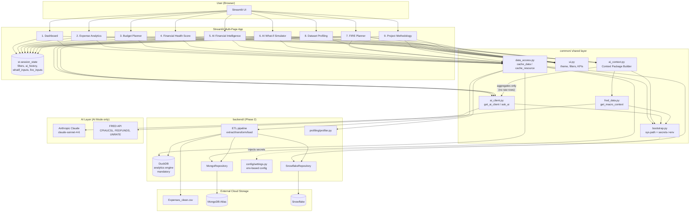
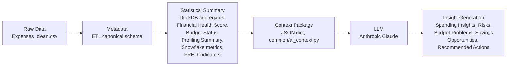

# Architecture Diagram (As-Built, Phase 4)

This reflects the implemented system (Phases 1-4), superseding the Phase 1
design diagram in `Architecture_Analysis_AI_Personal_Finance_Platform.md`.

## System overview

## Data-centric AI workflow (Phase 4 - hard constraint)

**The AI never receives raw transaction datasets.** Every value sent to the
LLM passes through `common/ai_context.py`, which only assembles already
aggregated/summary objects.

Allowed AI context (per page):

| Page | Context builder | Contents |
|---|---|---|
| 5. AI Financial Intelligence | `build_financial_intelligence_context()` | DuckDB results, Financial Health Score, Budget Status, Profiling Summary, Snowflake metrics, FRED macro |
| 6. AI What-if Simulator | `build_whatif_context()` | Scenario name + params, Python-computed What-if Results, FRED macro |
| 7. FIRE Planner | `build_fire_context()` | FIRE inputs, Python-computed FIRE Results, FRED macro |

In every case: **Python performs the calculations. The LLM only explains
the results** (Pages 6-7 system prompts explicitly forbid recomputation).

## Non-AI Mode vs AI Mode

| | Non-AI Mode (default / offline) | AI Mode |
|---|---|---|
| Trigger | `ANTHROPIC_API_KEY` not set -> `get_ai_client()` returns `None` | `ANTHROPIC_API_KEY` set -> real `anthropic.Anthropic` client |
| Pages 1-4, 8-9 | Fully functional (rules-based KPIs, charts, profiling) | Identical - no AI dependency |
| Page 5 | Shows the context package (`st.json`) that *would* be sent | Generates the 5-section Financial Intelligence report + chat |
| Page 6 | Shows Python-computed scenario projection | Adds an LLM explanation of the projection |
| Page 7 | Shows Python-computed FIRE number / age / scenarios | Adds an LLM FIRE Readiness/Risks/Recommendations explanation |
| FRED macro | `get_macro_context()` returns `{"available": False}` if `FRED_API_KEY` unset | Macro context included in the package above |

## Caching & state map

| Mechanism | Used for |
|---|---|
| `@st.cache_resource` | `get_duckdb_engine`, `get_mongo_repo`, `get_snowflake_repo`, `get_ai_client` |
| `@st.cache_data` | `load_transactions_df`, all `query_*` DuckDB wrappers, `get_profile_report`, `get_macro_context`, `build_*_context`, `snowflake_metrics_snapshot` |
| `st.session_state` | filters, `selected_period`, `ai_history`, `ai_insights_report`, `whatif_inputs`/`whatif_results`/`whatif_explanation`, `fire_inputs`/`fire_results`/`fire_explanation` |
